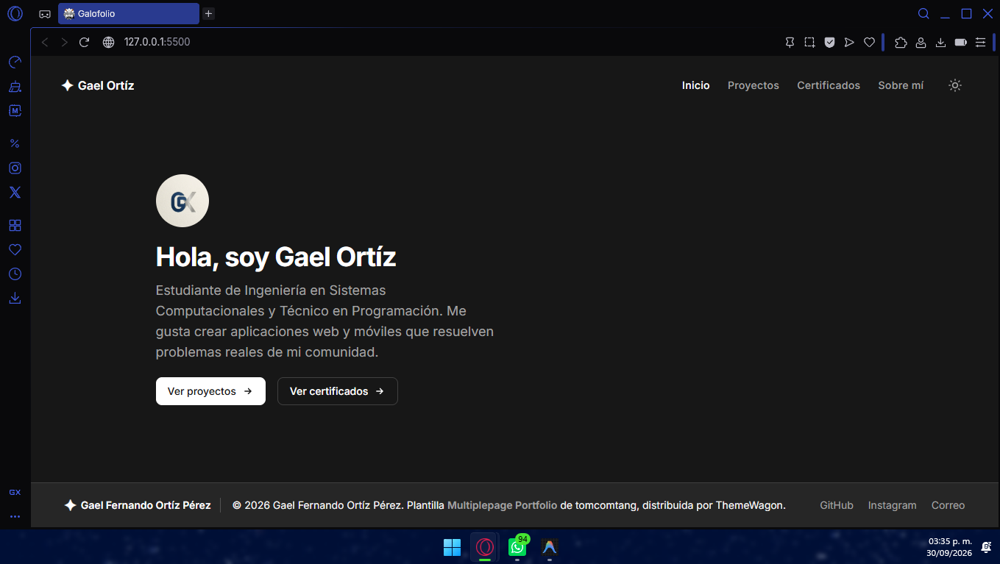
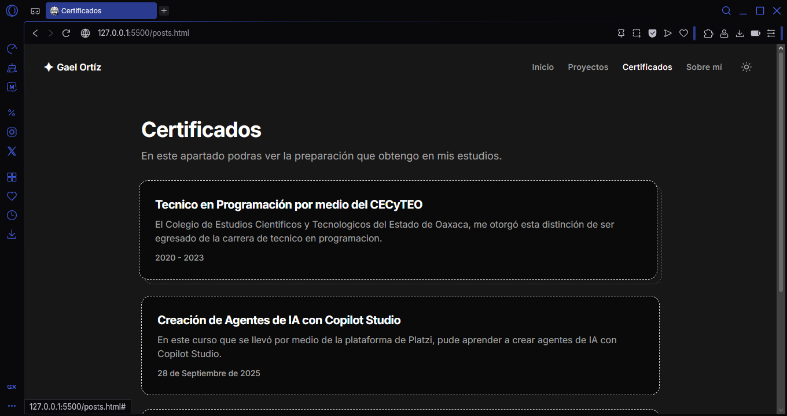
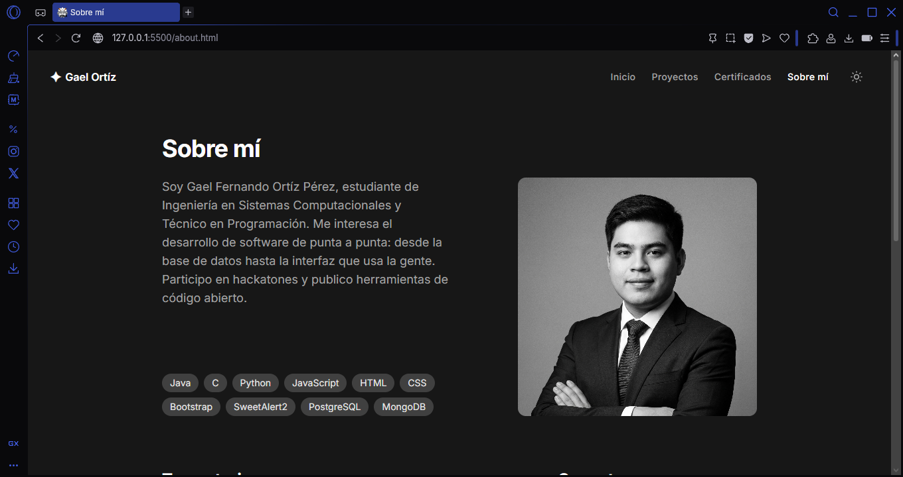
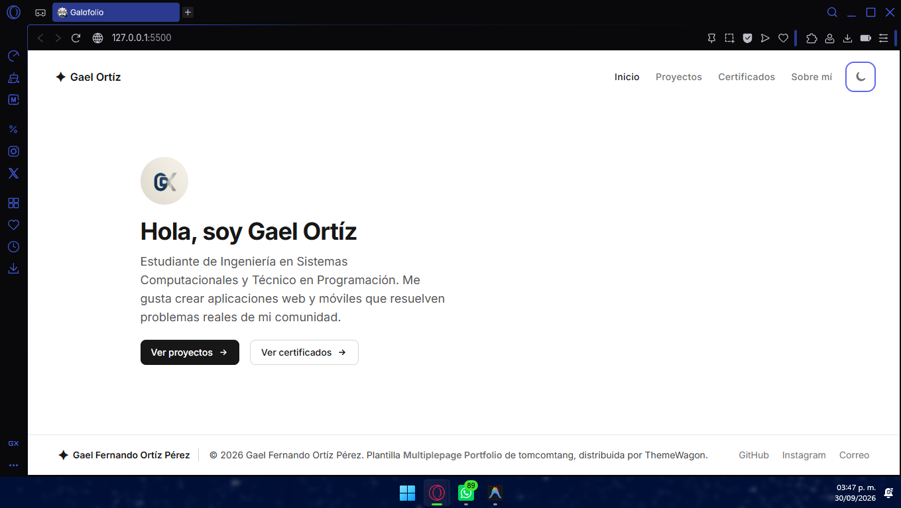

# Portafolio Web · Gael Fernando Ortíz Pérez

Portafolio personal de desarrollo de software, hecho con **HTML, CSS y JavaScript** y estilizado con **Tailwind CSS**.

- **Repositorio:** https://github.com/gaelfernando201579-netizen/portafolio-web
- **GitHub Pages:** https://gaelfernando201579-netizen.github.io/portafolio-web/



## Descripción del proyecto

**Framework CSS:** Tailwind CSS (vía CDN). No se mezcla con Bootstrap y no se usa ningún framework de JavaScript.

**Plantilla:** _Multiplepage Portfolio_ de tomcomtang, distribuida por ThemeWagon.

- Descarga: https://themewagon.com/themes/multiplepage-portfolio/

La plantilla original está hecha con Next.js y React. Para cumplir el requisito de no usar frameworks de JavaScript, reconstruí sus páginas, su estructura y su estilo visual en HTML estático con Tailwind por CDN.

### Menús y secciones

| Página                      | Descripción                                                                                                                       |
| --------------------------- | --------------------------------------------------------------------------------------------------------------------------------- |
| Inicio (`index.html`)       | Saludo, breve presentación, foto de perfil, botones hacia Proyectos y Certificados, e ilustración animada que cambia con el tema. |
| Proyectos (`projects.html`) | Tarjetas con borde punteado para Campy, BacheMap y Utileria.js, con portada y descripción.                                        |
| Certificados (`posts.html`) | Lista de certificados obtenidos.                                                                                                  |
| Sobre mí (`about.html`)     | Presentación, foto, etiquetas de skills, trayectoria en línea de tiempo y enlaces de contacto.                                    |

Todas las páginas comparten menú superior, botón de modo claro/oscuro y pie de página.

## Proceso de creación

1. **Análisis:** descargué la plantilla y revisé su estructura (`src/config` y `src/components`): cuatro páginas, menú, tarjetas de proyecto, línea de tiempo y tema claro/oscuro.
2. **Repositorio:** creé el repo público `portafolio-web` con `css/`, `js/` e `img/`.
3. **Conversión a HTML estático:** reescribí cada componente de React como HTML, conservando las clases de Tailwind de la plantilla.
4. **Tailwind:** lo cargué por CDN con `darkMode: 'class'`, igual que la plantilla original.
5. **CSS personalizado** (`css/portafolio.css`): animación flotante de la ilustración y el efecto de tarjetas punteadas que se desplazan al pasar el cursor.
6. **JavaScript** (`js/portafolio.js`): cambio de tema con `localStorage`, menú móvil y resaltado del enlace de la página actual.
7. **Cambios sobre la plantilla y por qué:**
   - Cambié todo el contenido por el mío y lo traduje al español.
   - Sustituí las fotos y portadas de ejemplo por mi foto y portadas propias.
   - Reemplacé la experiencia laboral de ejemplo por mi trayectoria académica y de proyectos.
   - Cambié Twitter por Instagram.
   - Los posts son un plan de escritura, aún sin artículos completos.
8. **Publicación:** subí el código y activé GitHub Pages en _Settings → Pages → Deploy from branch → main / (root)_.

## Capturas de pantalla







## Estructura

```
├── README.md
├── index.html
├── projects.html
├── posts.html
├── about.html
├── css/portafolio.css
├── js/portafolio.js
└── img/
```

## Créditos

Plantilla _Multiplepage Portfolio_ de tomcomtang, distribuida por ThemeWagon.
